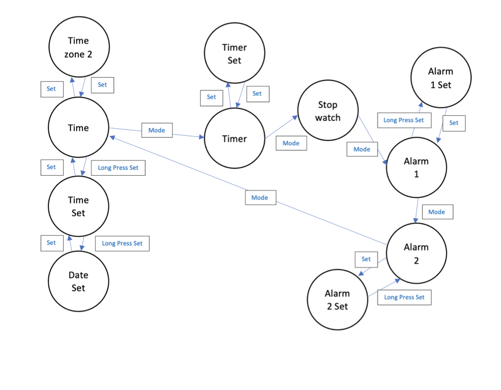

# Depth First Search

- This repository contains the code for the project which invlolved a depth first search for the modelling of a complicated wrist watch. This project was done in python and the use of the pycharm editor.
---
### Skills gained at the completion of the project
- Converting a real world problem into mathematical notation 
- Using the notation to plan out a way to solve the problem using graphs, trees and finite state automaton
- Converting all this to python code that implements the solution
---
### Installation/Use instructions
-   This can be run using an IDE or the IDLE shell.
---
### Completed Project
- Given below is the model for the complicated wrist watch as a finite state automata

---
### Notes about the Project
- Further improvements can be made to the efficiency of the search and the possibility of adding a GUI to see visualize the workings of the project.
---
